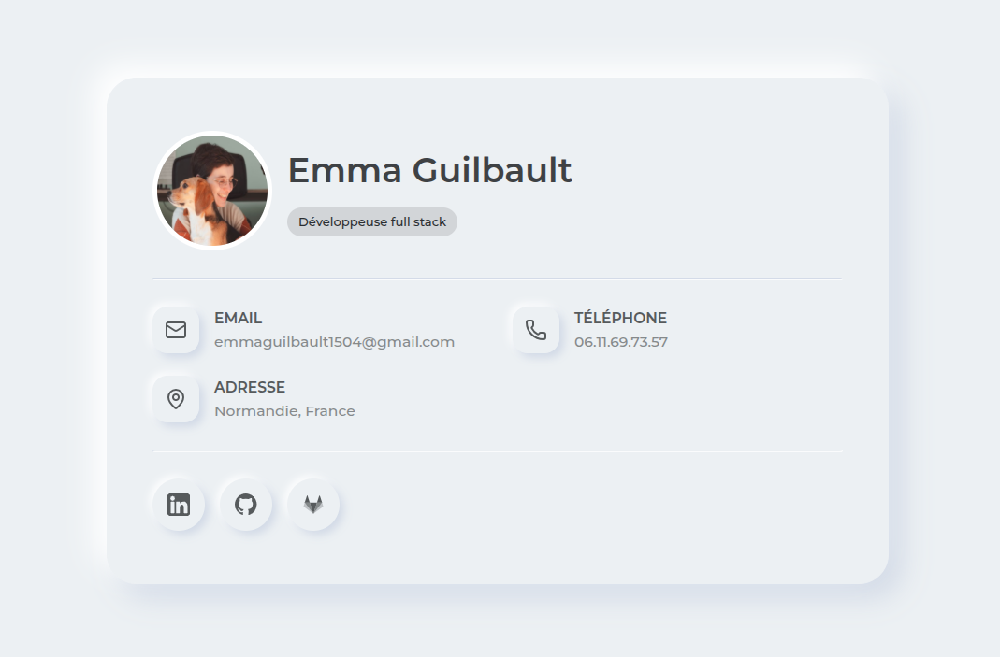

# Hi there! 👋

My name is Emma and I'm a french full stack developer living in Normandy! 🌦️🐄

I have 2 dogs: Pichu, a 5-year-old Beagle and Charly, a 16-year-old (!!!!) Cockapoo. 🐶🐶

I like working on projects that are environmentally and socially responsible. 🌱🤝

🌐 You can visit my [site](https://emma-guilbault.netlify.app/) to learn more about me!

## My projects

## As a full stack developer

Here is my Github account, where you can find my online CV (React / TS).

### As a DevOps

Here is my [Gitlab account](https://gitlab.com/emmaguilbault1504) where you will find my DevOps projects! In 2026, I completed an intensive DevOps training course entitled "DevOps System Administrator" where I learned:

- Continuous Integration and Continuous Deployment (CI/CD)
- Containerization (Docker, Docker Compose and Kubernetes)
- Monitoring (Grafana, Prometheus, Loki, etc.)
- Cloud providers (AWS and Linode)
- Infrastructure as Code (Terraform, Ansible, etc.)
